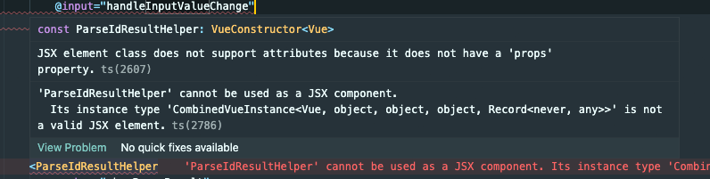
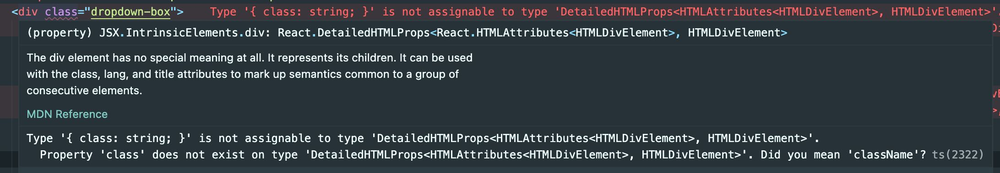

# 现象
正常的sfc的vue文件提示提示一下奇怪的JSX问题，甚至有解析成React之类的...

```js
Type '{ class: string; }' is not assignable to type 'DetailedHTMLProps<HTMLAttributes<HTMLElement>, HTMLElement>'.
  Property 'class' does not exist on type 'DetailedHTMLProps<HTMLAttributes<HTMLElement>, HTMLElement>'. Did you mean 'className'?
```





# 解决方法
vue2用vetur，vue3的项目再用volar
