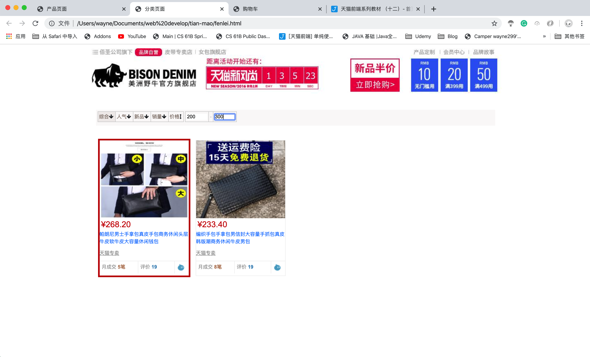
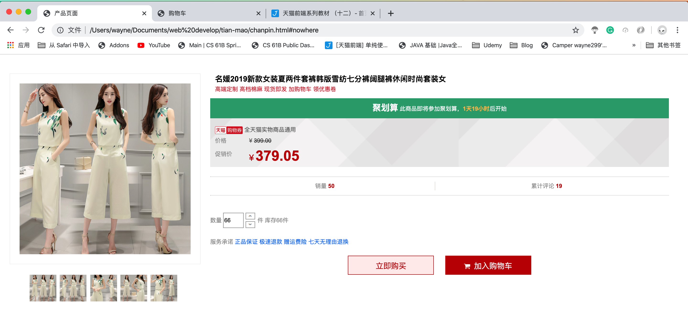
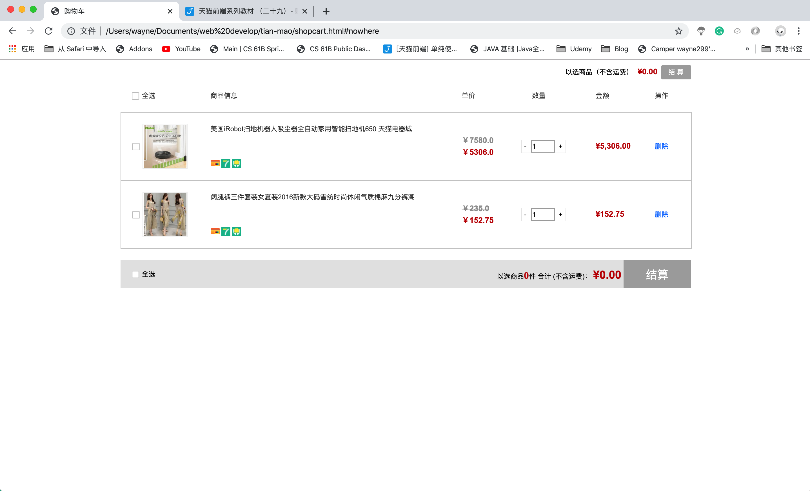
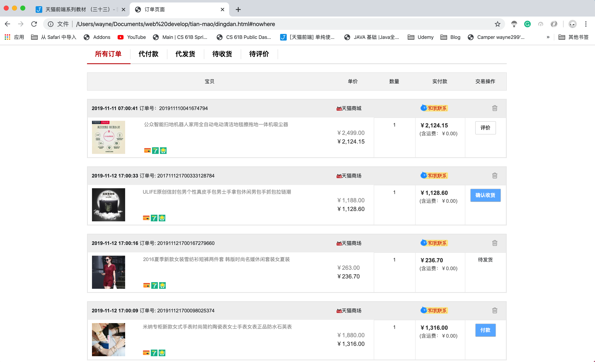
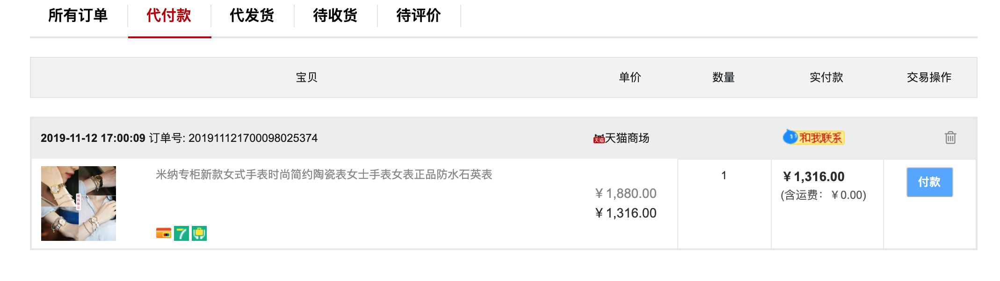
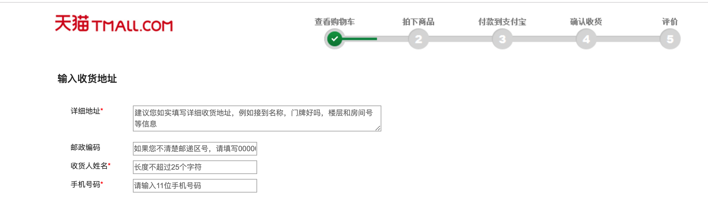
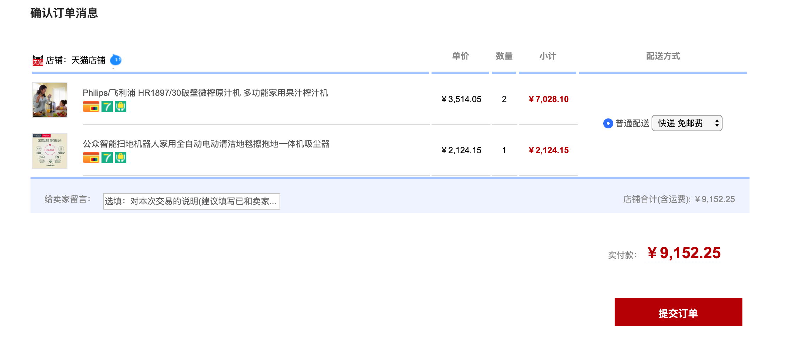
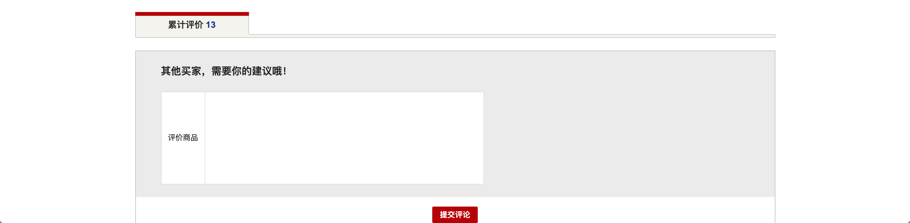
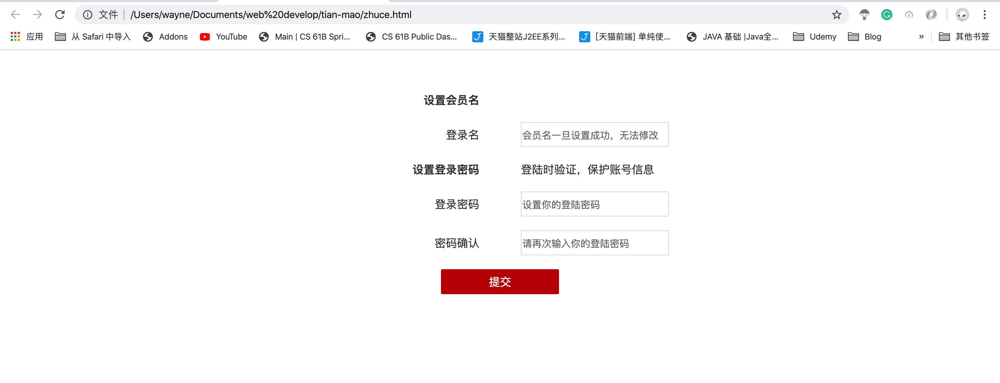

# 天猫网站前端设计
[GitHub](https://github.com/Wayne299/tmall-website)同步训练，搭建完成前记录效果截图。

当前进度：node+express 搭建，因没有数据库后台，只是功能上的展示

## 公共部分

<!--more-->
### 1. 置顶导航、页脚

### 2. 搜索栏

### 3. 简易搜索栏

## 首页
### 1. 分类、导航轮播

### 2. 交互
 - 显示、隐藏产品列表

## 分类
### 1. 产品列表

### 2. 交互
 - 选择价格

## 产品
### 1. 产品图片、基本信息

### 2. 产品详情

### 3. 产品评论

### 4. 交互
 - 鼠标移动到小图片，大图片一起变化（图片的预加载）
 - 产品详情和产品评论的切换

## 购物车
### 1. 结算、订单内容

### 2. 交互
 - 选中物品（结算button和价格的变化）

 - 全选（直接点击 和 分别选中）
 
 - 增加、减少数量及直接修改

## 订单
### 1. 标题、订单内容

### 2. 交互
 - 切换不同类型的订单

## 结算
### 1. 头部、收货地址

### 2. 订单信息

### 3. 交互
 - 点击input，显示textarea。
 - 同步和限制字数

## 支付

## 支付成功

## 确认收货
### 1. 订单

### 2. 详情

## 收货成功

## 评价
### 1. 评价商品信息

### 2. 商品评价

## 登陆

## 注册
