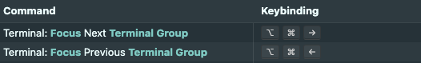
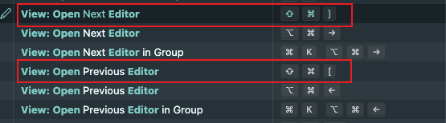
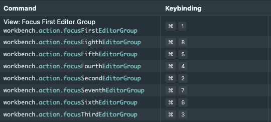

# 光标移动
## 整体移动一行
- <kbd>Option</kbd> + 上/下

## 下一个单词
- <kbd>Option</kbd> + 左/右

## 删除一个单词
- <kbd>Option</kbd> + <kbd>Delete</kbd>

## 删除一行
- 直接剪切掉：<kbd>Command</kbd> + <kbd>x</kbd>
- 删除：<kbd>Command</kbd> + <kbd>Shift</kbd> + <kbd>K</kbd>

# 批量操作
## 批量选择
- <kbd>Command</kbd> + <kbd>D</kbd>

## 批量复制光标以添加内容
- <kbd>Control</kbd> + <kbd>Option</kbd> + 上/下

## 批量替换当前文件中所有匹配的文本
- <kbd>Command</kbd> + <kbd>F2</kbd>

# 激活/聚焦
## 全局查找时逐项查看
- <kbd>F4</kbd>

## 下一个Terminal / 下一个编辑器 Tab页
- <kbd>Option</kbd> + <kbd>Command</kbd> + 左/右
<!-- more -->

## focus 不同的编辑分区
- <kbd>Command</kbd> + 数字键

## 移动 编辑器到其他分区
- <kbd>Control</kbd> + <kbd>Command</kbd> + 左/右

